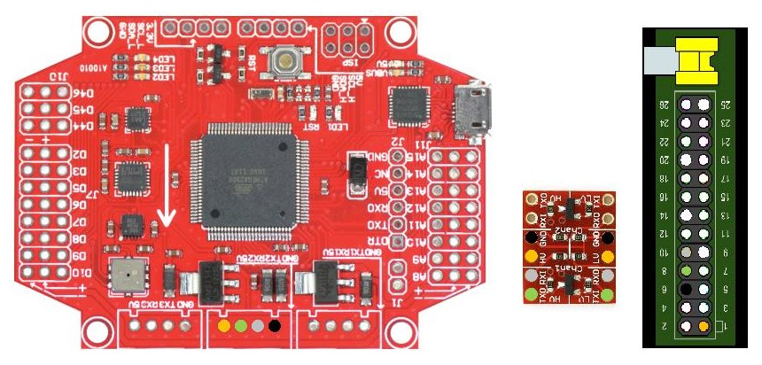

# MultiWii Node Raspberry Pi Client

This package is used for [vi-kon/multi-node-gui](https://github.com/vi-kon/multiwii-node-gui) package's client. This package use serial protocol to communicate with Fly Controller and TCP/IP protocol to communicate with server.

## Requirements

### Software requirements

* nodeJS
  * net
  * serialport
  * multiwii-msp

### Hardware requirements

* **MultiWii Fly Controller** (FC board)
* **Raspberry Pi** with **Raspbian** (tested only with Raspberry B)
* **WiFi** or **Ethernet** connection
* **Bidirectional logic level converter** 5v to 3.3v

Note: Should work with another nodeJS capable board not only with Raspberry Pi.

## Wire connection

In this demonstration I used MultiWii Pro.

Level converter is needed because Raspberry Pi uses 3.3v SPI and MultiWii uses 5v SPI. So Logic level converters's HV (High voltage) side is for MutliWii and LV (Low voltage) side is for Raspberry Pi.



## Installation

Copy project files to destination directory in your Raspberry Pi.

For example `/home/pi/mwn-node-client/`.

## Configuration

The `config.js` file contains configuration options.

```javascript
var config = {
    // Api key for server
    api   : '',
    tcp   : {
        // Server host address
        host: '10.10.10.1',
        // Server listening port
        port: 3002
    },
    serial: {
	    // Serial port
        port    : '/dev/ttyAMA0',
        // Serial port baud rate
        baudRate: 115200
    }
};
```

* **api** - not in use
* **tcp.host** - server IP address or URL
* **tcp.port** - opened server port
* **serial.port** - serial port for MultiWii connection
* **serial.baudRate** - serial port baud rate

## Usage

To start client execute `node client.js` or `node client` command in project directory.

After it application start trying connect to server until server accepts connection. If connection lost the application start reconnecting to server.

## Api

The application receive request message over TCP connection. The request messages are put at the end of waiting queue. The message from beginning of waiting queue is sent to MultiWii. If a response is received, then it is forwarded over TCP connection to the server. If response timeout (1000 ms) reached, then next message is requested from queue.

### TCP Protocol

The general format of TCP message is:

`{header}{direction}{length}{id}{code}{payload}{crc}`

Where:

* **header** - is ASCII character `$M`
* **direction** - is ASCII character `<` if message is request or `>` if message is response
* **length** - the `payload` length
* **id** - message unique identifier [0-255], used to pair request and response messages
* **code** - MSP message command id
* **payload** - message data
* **crc** - checksum, calculated by XOR of `{id}`, `{code}`, `{length}` and each byte of `{payload}`

### MultiWii Serial Protocol

The general format of MSP message is:

`{header}{direction}{length}{code}{payload}{crc}`

Where:

* **header** - is ASCII character `$M`
* **direction** - is ASCII character `<` if message is request or `>` if message is response
* **length** - the `payload` length
* **code** - MSP message command id
* **payload** - message data

Commands documented at: [MultiWii Serial Protocol](http://www.multiwii.com/wiki/index.php?title=Multiwii_Serial_Protocol)

## License

This package is licensed under the MIT License